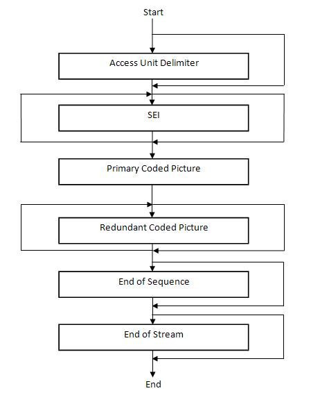

# 了解 H.264

- [了解 H.264](#%e4%ba%86%e8%a7%a3-h264)
  - [概念](#%e6%a6%82%e5%bf%b5)
    - [图像/帧类型](#%e5%9b%be%e5%83%8f%e5%b8%a7%e7%b1%bb%e5%9e%8b)
    - [帧内压缩和帧间压缩](#%e5%b8%a7%e5%86%85%e5%8e%8b%e7%bc%a9%e5%92%8c%e5%b8%a7%e9%97%b4%e5%8e%8b%e7%bc%a9)
    - [图像群组 GOP](#%e5%9b%be%e5%83%8f%e7%be%a4%e7%bb%84-gop)
    - [网络抽象层 NAL](#%e7%bd%91%e7%bb%9c%e6%8a%bd%e8%b1%a1%e5%b1%82-nal)
      - [NAL 单元 NALU](#nal-%e5%8d%95%e5%85%83-nalu)
      - [VCL 和 non-VCL NALU](#vcl-%e5%92%8c-non-vcl-nalu)
        - [参数集 parameter sets](#%e5%8f%82%e6%95%b0%e9%9b%86-parameter-sets)
      - [访问单元 access unit](#%e8%ae%bf%e9%97%ae%e5%8d%95%e5%85%83-access-unit)
      - [编码视频序列 coded video sequence](#%e7%bc%96%e7%a0%81%e8%a7%86%e9%a2%91%e5%ba%8f%e5%88%97-coded-video-sequence)
      - [NAL 综述](#nal-%e7%bb%bc%e8%bf%b0)
  - [H.264](#h264)
    - [关键帧](#%e5%85%b3%e9%94%ae%e5%b8%a7)
    - [H.264 NALU](#h264-nalu)
  - [参考](#%e5%8f%82%e8%80%83)

## 概念

```text
MPEG
  moving picture experts group, 动态图像专家组
MVC
  multiview video coding, 多视图编码
SVC
  scalable video coding, 可适应视频编码
HEVC
  high efficiency video coding, 高效率视频编码
GOP
  group of pictures, 图像群组
NAL
  network abstraction layer, 网络抽象层
NALU
  network abstraction layer unit, 网络抽象层单元
IDR
  instantaneous decoding refresh, 即时解码刷新
SEI
  supplemental enhancement information, 补充增强信息
SPS
  sequence parameter sets, 序列参数集
PPS
  picture parameter sets, 图像参数集
```

### 图像/帧类型

通常，图像帧是一组一组进行处理的。每组的第一帧(通常是第一帧)在编码的时候不使用运动估计的办法，这种帧称为帧内编码帧(Intra frame)或者 I 帧。该组中的其它帧使用帧间编码帧(Inter frame)，通常是 P 帧。这种编码方式通常被称为 IPPPP，表示编码的时候第一帧是 I 帧，其它帧是 P 帧。

在进行预测的时候，不仅可以从过去的帧来预测当前帧，还可以使用未来的帧来预测当前帧。当然在编码的时候，未来的帧必须比当前帧更早的编码，也就是说，编码的顺序和播放的顺序是不同的。通常这样的当前帧是使用过去和未来的 I 帧或者 P 帧同时进行预测，被称为双向预测帧，即 B 帧。这种编码方式的编码顺序的一个例子为 IBBPBBPBBPBB。

在视频压缩设计中，使用三种不同的算法压缩视频帧。这些视频帧的不同算法称作**图像类型**或**帧类型**。不同的视频算法使用的三种主要的图像类型是 **I**、**P** 和 **B**。

- I 帧(intra-coded picture, 节点图像)：可压缩性最小，但是不需要额外视频帧解码。是一个完整的图像，就像一个 JPG 或 BMP 图像文件。
- P 帧(predicted picture, 预测图像)：可使用之前的帧解压缩，且比 I 帧可压缩性更高。只保存相对于之前帧的变动。比如，在一个场景中，车子移动穿过一个静止的背景，只需要编码车子的移动。编码器不需要存储 P 帧中未变动的背景像素，因此节省了空间。P 帧也称作 delta 帧。
- B 帧(bidirectional picture, 双向预测图像)：可使用之前和之后的帧作为参考数据，以获得最高的数据可压缩性。通过使用当前帧与前后帧的差别来确定内容以节省更多空间。

### 帧内压缩和帧间压缩

帧内压缩(intraframe compression)：也称为空间压缩。当压缩一帧图像时，仅考虑本帧的数据而不考虑相邻帧之间的冗余信息，这实际上与静态图像压缩类似。帧内一般采用有损压缩算法，达不到很高的压缩比。

帧间压缩(interframe compression)：也称为时间压缩。是基于许多视频或动画的连续前后两帧具有很大的相关性(即连续的视频其相邻帧之间具有冗余信息)的特点来实现的。通过比较时间轴上不同帧之间的数据实施压缩，进一步提高压缩比。一般是无损压缩。

### 图像群组 GOP

在视频编解码中，一组图像，或 GOP 结构，指定了帧间和帧内的组织顺序。GOP 是一个编码视频流内的连续图像的集合。每个编码的视频流由连续的 GOP 组成，可视化帧由这些 GOP 生成。在一个压缩的视频流中遇到一个新的 GOP 意味着解码器不需要之前的帧来解码一个新的帧，且支持对视频进行快速 seek 操作。

一个 GOP 可以包含下面的图像类型：

- I 图像或 I 帧：每个 GOP 以这种类型的图像开始(按照解码顺序)。
- P 图像或 P 帧：在旧设计比如 MPEG-1，H.262/MPEG-2 和 H.264 中，每个 P 图像只能参考一个图像，且该参考图像在显示和解码顺序上必须位于之前，此外，参考图像只能是一个 I 或 P 图像。这些限制不适用于新标准 H.264/MPEG-4 AVC 和 HEVC。
- B 图像或 B 帧：在旧设计比如 MPEG-1 和 H.262/MPEG-2，每个 B 图像只能参考两张图像，显示顺序分别位于之前和之后一帧，且所有参考图像必须是 I 或 P 图像。这些限制不适用于新标准 H.264/MPEG-4 AVC 和 HEVC。
- D 图像或 D 帧(DC direct coded picture)：只在 MPEG-1 视频中使用。

通常，编码器使用 GOP 结构，将每个 I 帧作为一个“干净的随机访问点”，以便解码器可以在一个 I 帧上开始解码，且 GOP 结构内部遇到的任何错误在处理一个正确的 I 帧之后都可以修正。

一般来说，视频流的 I 帧越多，视频的可编辑性越好。然而，I 帧越多，导致编码视频需要的比特率增大。

通常使用两个数字引用**GOP 结构**。比如 M=3，N=12。第一个数字表示两个锚帧(I 或 P)的距离。第二个数字表示两个完整图像(I 帧)直接的距离：这是 GOP 的大小。比如对于例子 M=3，N=12,GOP 结构是 IBBPBBPBBPBBI。参数 M 可用于两个连续的的锚帧之间 B 帧的最大数目。

比如，在模式序列 IBBBBPBBBBPBBBBI，GOP 大小(参数 N)是 15(I 帧之间的距离)，两个锚帧之间的距离(参数 M)是 5 (I 和 P 帧之间的长度或两个连续的 P 帧之间的距离)。

一个 GOP 帧的显示顺序是：I0、B1、B2、B3、P4、B5、B6、B7、P8、B9、B10、B11、I12；则编解码顺序为：I0、P4、B1、B2、B3、P8、B5、B6、B7、I12、B9、B10、B11。

### 网络抽象层 NAL

NAL 是 H.264/AVC 和 HEVC 视频编码标准的一部分。NAL 设计强调灵活性和可定制性，将视频的视频编码层(video coding layer, VCL) 表示格式化，且不同传输层或存储媒介提供了适合传输的头信息。

NAL 的设计用于提供“网络友好性”，使能为不同系统简单有效的定制 VCL 的使用。NAL 促进映射 VCL 数据到传输层的能力。

#### NAL 单元 NALU

编码的视频数据被组织成 NALU，每个 NALU 是一个有效的包，包含整数字节。每个 H.264/AVC 的 NALU 第一个字节是一个头字节，包含一个 NALU 内数据类型的标识符。HEVC 的头扩展为两个字节。头字节标识着剩下的字节包含了这种类型的载荷。NALU 结构定义指定了一种通用于面向包和面向比特流传输系统的格式，并且编码器生成的一系列 NALU 组成一个 NALU 流。

#### VCL 和 non-VCL NALU

NALU 分为 VCL 和 non-VCL NALU：

- VCL NALU：包含数据，表示视频图像内的采样值
- non-VCL NALU：包含相关的其他信息，比如参数集(重要的头数据，可应用域大量的 VCL NALU)和 SEI (时间信息和其他补充数据，这些数据可以改善解码的视频信号的可用性，但是对于解码视频图像的采样值不是必需的)。

##### 参数集 parameter sets

参数集应该包含的信息是预期不常变化，且帮助解码大量 VCL NALU。有两种类型的参数集：

- 序列参数集 SPS：应用于一系列连续的编码的视频图像，叫做一个编码的视频序列
- 图像参数集 PPS：应用于解码一个编码的视频序列内的一个或多个单独的图像

SPS 和 PPS 将传输不规则变化的信息和传输视频图片内的采样值的编码表示解耦合。每个 VCL NALU 包含一个标识符，标识相关的 PPS 的内容。且每个 PPS 包含一个标识符，标识相关的 SPS 的内容。按照这种方式，一小段数据(标识符)可用于索引一大段信息(参数集)，而不用在每个 VCL NALU 内重复这段信息。

SPS 和 PPS 也可以在应用的 VCL NALU 之前发送，且可以重复发送以提供健壮性防数据丢失。在一些应用中，参数集可以在携带 VCL NALU 的通道发送(即 “in-band” 传输)。在其他应用中，使用一个比视频通道更可靠的传输机制传输参数集(“out-of-band” 传输)更加有好处。

#### 访问单元 access unit

一系列 NALU 按指定格式组成一个**访问单元**。每个访问单元解码生成一个解码的图像。

每个访问单元包含一系列 VCL NALU，这些 VCL NALU 组成一个**基本编码图像**(primary coded picture)。基本编码图像包含一系列 VCL NALU，这些 VCL NALU 组成**切片**(slice)或**切片数据分区**(slice data partition)，表示视频图像的采样。

也可以加一个**访问单元分隔符**(access unit delimiter)前缀以便帮助定位访问单元的起始处。

一些包含类似图像时间信息的 SEI 也可能在基本编码图像之前。

跟在基本编码图像之后可能是一些额外的 VCL NALU，它们包含相同视频图像区域的冗余表示。它们称为**冗余编码图像**(redundant coded picture)，且可用于解码器从基本编码图像的数据丢失或破坏中恢复。如果冗余编码图像存在，不要求解码器解码它们。

最后，如果编码图像是编码视频序列(一系列可独立解码且只使用一个 SPS 的图像)的最后一个图像，可能出现一个**序列结束**(end of sequence) NALU 表示序列的结束；并且，如果这个编码图像是整个 NALU 流的最后一个编码图像，可能出现一个**流结束** (end of stream) NALU表示流的结束。



#### 编码视频序列 coded video sequence

一个编码视频序列由一系列访问单元组成，这些访问单元在 NALU 流中是按次序的且只使用一个 SPS。如果给出必须的参数集信息(可 “in-band” 或 “out-of-band” 传输)，每个编码视频序列可独立于其他编码视频序列解码。

视频编码序列开始是一个 **IDR** 访问单元。一个 IDR 访问单元包含一个**帧内图像**(intra picture)，它是 NALU 流中的一个编码图像，可不依赖之前的图像解码。出现一个 IDR 访问单元表示这个流之后的图像不需要依赖这个 IDR 之前的图像解码。一个 NALU 流可能包含一个或多个编码视频序列。

#### NAL 综述

编码的视频数据分成一系列 NALU，组成 NALU 流。

可独立解码的编码视频序列：一个 IDR 访问单元(可独立解码) + 其他访问单元。只使用一个 SPS。

访问单元：访问单元分隔符(可选) + SEI(可选) + 基本编码图像 + 冗余编码图像(可选) + 序列结束(可选) + 流结束(可选)。

## H.264

**H.264**，又称为 **MPEG-4 第 10 部分，高级视频编码**(MPEG-4 Part 10, Advanced Video Coding, MPEG-4 AVC)是一种面向块，基于运动补偿的视频编码标准。

### 关键帧

关键帧是不依赖前后帧的独立的一帧图像。关键帧也叫 I 帧。插入关键帧的场景：

- 前后帧变化信息较大
- 有规律插入关键帧便于 seek 操作

插入关键帧的间隔叫做 I 帧间隔，或 I 帧距离，也是 GOP 长度/大小。

解码器遇到 IDR 帧，可以清空之前的解码序列。且之前的解码错误不会影响之后的处理。

### H.264 NALU

H.264 码流前三个 NALU 分别是 SPS、PPS 和 IDR。

使用 RTP 传输 H.264 时需要用到 SDP 协议描述，其中需要用到两项 SPS 和 PPS。需要从 H.264 码流中获取 SPS 和 PPS：

- H.264 码流都是以 `0x00 00 01` 或者 `0x00 00 00 01` 为开始码，找到开始码之后使用开始码之后的第一个字节的低 5 位判断是否为 7(SPS) 或者 8(PPS), 即 `data[4] & 0x1f == 7 || data[4] & 0x1f == 8`。
- 然后对获取的 NAL 去掉开始码进行 base64 编码，得到的信息就可以用于 SDP。PS 和 PPS 需要用逗号分隔开。

NALU 类型码：

```c
enum {
    H264_NAL_UNSPECIFIED     = 0,
    H264_NAL_SLICE           = 1,// 非关键帧
    H264_NAL_DPA             = 2,
    H264_NAL_DPB             = 3,
    H264_NAL_DPC             = 4,
    H264_NAL_IDR_SLICE       = 5,// 关键帧
    H264_NAL_SEI             = 6,
    H264_NAL_SPS             = 7,// SPS 帧
    H264_NAL_PPS             = 8,// PPS 帧
    H264_NAL_AUD             = 9,
    H264_NAL_END_SEQUENCE    = 10,
    H264_NAL_END_STREAM      = 11,
    H264_NAL_FILLER_DATA     = 12,
    H264_NAL_SPS_EXT         = 13,
    H264_NAL_PREFIX          = 14,
    H264_NAL_SUB_SPS         = 15,
    H264_NAL_DPS             = 16,
    H264_NAL_RESERVED17      = 17,
    H264_NAL_RESERVED18      = 18,
    H264_NAL_AUXILIARY_SLICE = 19,
    H264_NAL_EXTEN_SLICE     = 20,
    H264_NAL_DEPTH_EXTEN_SLICE = 21,
    //...
};
```

有时并不能直接得到 NALU，文件中也没有 `0x00 00 01` 或者 `0x00 00 00 01` 分隔符：包中的数据起始处没有分隔符, 也不是 0x65、0x67、0x68、0x41 等字节，所以肯定这不是标准的 NALU。前 4 个字节表示 NALU 的长度(MP4 格式)，从第 5 个字节开始才是 NALU 的数据。所以直接将前 4 个字节替换为 `0x00 00 01` 或者 `0x00 00 00 01` 即可得到标准的 NALU 数据。

 ffmpeg 获取 PPS 和 SPS：

- PPS 及 SPS 不能从包获得，而是保存在 AVCodecContext 的 extradata 数据域中
- 一般地，extradata 中包含一个 SPS、一个 PPS 的 NALU, 从 h264_mp4toannexb_bsf.c 代码中容易看出 extradata 的数据格式
- 分析后的 SPS 及 PPS 依然储存在 extradata 域中，并添加了起始符

## 参考

- [Advanced Video Coding](https://en.wikipedia.org/wiki/Advanced_Video_Coding)
- [运动补偿](https://zh.wikipedia.org/wiki/%E8%BF%90%E5%8A%A8%E8%A1%A5%E5%81%BF)
- [Video compression picture types](https://en.wikipedia.org/wiki/Video_compression_picture_types)
- [Group of pictures](https://en.wikipedia.org/wiki/Group_of_pictures)
- [Network Abstraction Layer](https://en.wikipedia.org/wiki/Network_Abstraction_Layer)
